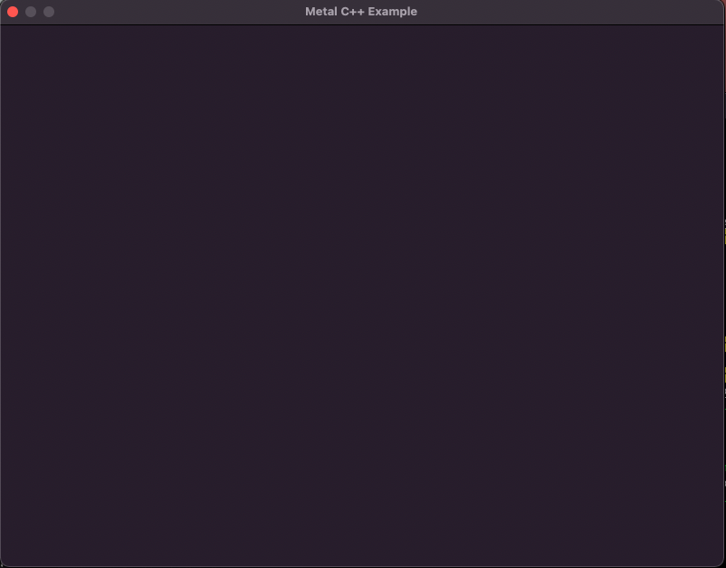
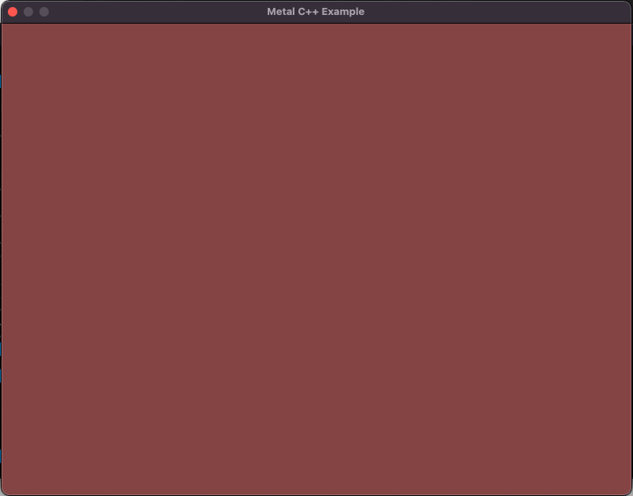
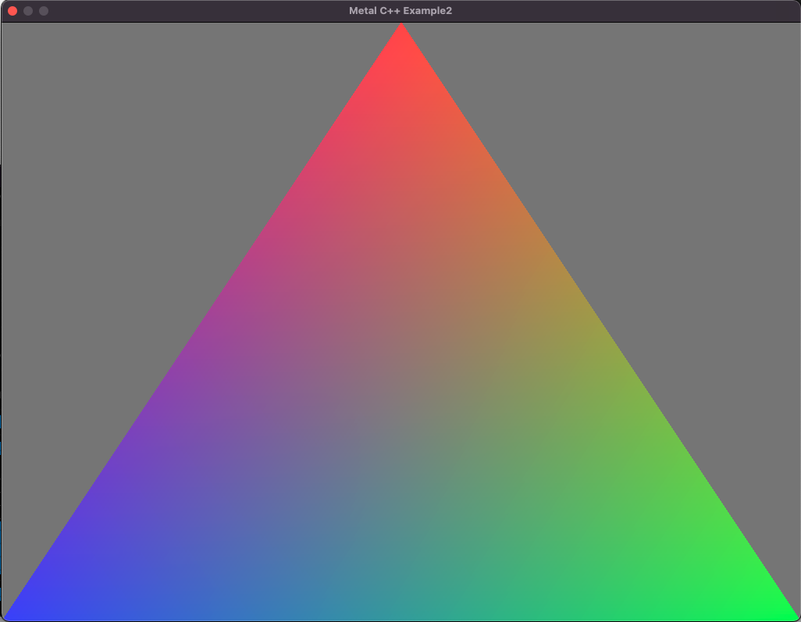
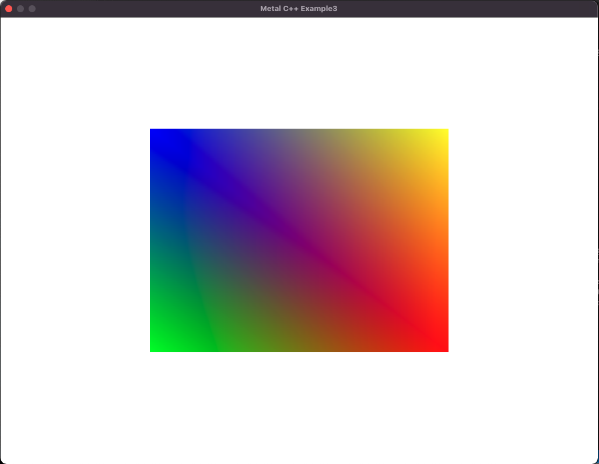
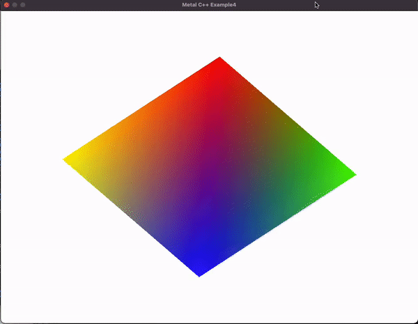
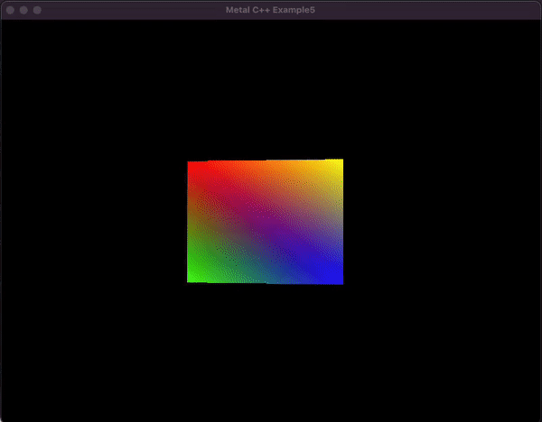
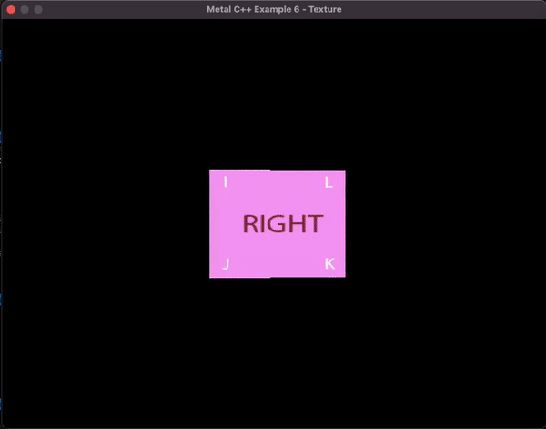

# metal-api-tutorial

Minimal bare metal [Apple Metal Graphics API](https://developer.apple.com/kr/metal/) example tutorial repo.

# Sample code

- step0_simple_window

- step1_basic_setup

- step2_triangle

- step3_mtlbuffer_rectangle

- step4_uniform_update

- step5_going3d

- step6_texture

- step7_synchronization
- step8_gpgpu
- step9_multipass

# Dependencies

- [Cocoa](https://developer.apple.com/library/archive/documentation/Cocoa/Conceptual/CocoaFundamentals/WhatIsCocoa/WhatIsCocoa.html) is Apple's native object-oriented application programming interface (API) for its desktop operating system macOS.
- [Metal](https://developer.apple.com/kr/metal/) is a platform-optimized, low-overhead API for developing the latest 3D pro applications and amazing games using a rich shading language with tighter integration between graphics and compute programs.
- [QuartzCore](https://developer.apple.com/documentation/quartzcore), also known as Core Animation, is an Objective-C framework that to declaratively build an animatable scene graph.